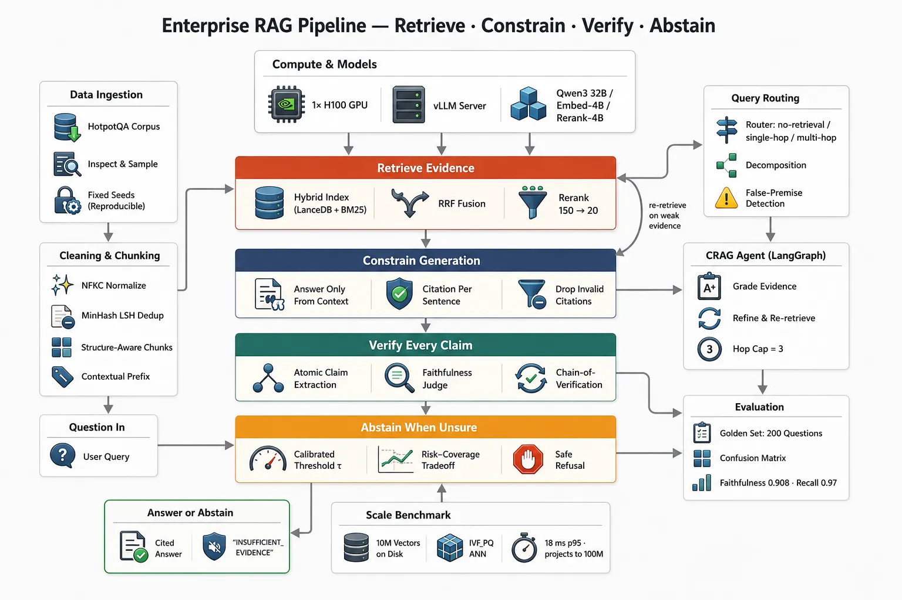

# RAG Failure Diagnostics

A fluent wrong answer is often blamed on "the model" even when the real failure happened earlier: the index was stale, chunks split the evidence, the query router chose the wrong corpus, or the evaluator never tested the scenario.

Debug retrieval-augmented generation as a pipeline. Preserve the evidence from each stage, find the first incorrect transition, change one structural cause, and replay the same incident.

---

## The Pipeline to Inspect

```text
source → parse → chunk → embed → index
                                  ↓
question → rewrite → route → retrieve → rerank → context → generate → cite
                         ↓          ↓          ↓           ↓
                       trace      trace      trace       graders
```

For one failing question, capture:

```json
{
  "incident_id": "rag-2026-0717-001",
  "question": "...",
  "expected_facts": ["..."],
  "corpus_version": "2026-07-17T09:00Z",
  "original_query": "...",
  "rewritten_queries": ["..."],
  "selected_route": "product-docs",
  "retrieved_chunk_ids": ["doc-14#chunk-3"],
  "reranked_chunk_ids": ["doc-14#chunk-3"],
  "rendered_context": "...",
  "answer": "...",
  "citations": ["doc-14#chunk-3"],
  "model": "...",
  "prompt_version": "..."
}
```

Without this trace, teams tend to adjust prompts blindly and cannot tell whether the same failure returned.

---

## Triage Order

Work from the source toward the answer:

1. **Source:** Is the correct fact present and permitted for this user?
2. **Index:** Was the right document parsed, chunked, embedded, and indexed?
3. **Query:** Did rewrite and routing preserve the user's intent?
4. **Retrieval:** Did the right evidence appear in the candidate set?
5. **Reranking:** Was good evidence retained and prioritized?
6. **Context assembly:** Did truncation, ordering, or deduplication remove it?
7. **Generation:** Did the answer follow the supplied evidence?
8. **Citations:** Do cited passages actually support each claim?
9. **Evaluation:** Would the existing test suite catch this exact failure?

Stop at the first incorrect transition. Later symptoms often disappear when that stage is fixed.

---

## Failure Taxonomy

### R01 — Grounding Drift

**Symptom:** The answer contradicts or extends beyond retrieved evidence.

**Confirm:** The needed evidence is in the rendered context, but claims are unsupported or conflict with it.

**Fix:** Require claim-level citations, add an insufficient-evidence response, tighten context instructions, and grade entailment between claims and cited passages.

Do not fix retrieval if retrieval already supplied the correct passage.

### R02 — Chunk Boundary Failure

**Symptom:** A definition, table row, exception, or procedure is split across chunks and no single result contains enough context.

**Confirm:** The source has the answer, but retrieved chunks contain only fragments around it.

**Fix:** Use structure-aware splitting, preserve headings and table units, add overlap selectively, or retrieve parent sections after matching a child chunk.

### R03 — Embedding or Similarity Mismatch

**Symptom:** Semantically relevant content consistently ranks below superficially similar text.

**Confirm:** A labeled relevance set shows low recall even with a generous `k`; lexical lookup may find the document that vector search misses.

**Fix:** Evaluate another embedding model, normalize content consistently, use domain-aware representations, or combine keyword and vector retrieval.

### R04 — Index Staleness or Skew

**Symptom:** Answers use old content or miss recently published documents.

**Confirm:** Compare source revision, ingestion checkpoint, index version, and document count. Query the exact document ID.

**Fix:** Make ingestion idempotent, record source versions, expose freshness metrics, support deletions, and fail health checks when lag exceeds policy.

### R05 — Query Rewrite or Routing Misalignment

**Symptom:** The system searches the wrong corpus, tenant, language, timeframe, or interpretation.

**Confirm:** Inspect the original question, rewritten query, route decision, filters, and router confidence.

**Fix:** Preserve named entities and constraints, use typed routes, add low-confidence fallback, and test ambiguous queries.

### R06 — Reranker or Context-Assembly Loss

**Symptom:** Good evidence appears in initial retrieval but disappears before generation.

**Confirm:** Compare candidate IDs after retrieval, reranking, deduplication, token budgeting, and final prompt rendering.

**Fix:** Tune reranking on labeled examples, reserve context budget per source, remove duplicate boilerplate, and log truncation explicitly.

### R07 — Tool or Citation Misuse

**Symptom:** The agent calls retrieval with wrong arguments, cites a chunk it did not use, or gives a citation that does not support the claim.

**Confirm:** Replay tool calls; compare claim text against cited passage.

**Fix:** Validate tool schemas, restrict citation IDs to retrieved evidence, and run citation completeness and entailment graders.

### R08 — Memory or Session Leakage

**Symptom:** The answer uses facts from another conversation, user, tenant, or stale session—or forgets required facts from the current one.

**Confirm:** Reproduce with clean session IDs and concurrent users; inspect cache and memory keys.

**Fix:** Namespace by tenant/user/session, define retention, separate durable profile from conversation state, and test deletion and isolation.

### R09 — Evaluation Blind Spot

**Symptom:** Offline scores look healthy while real incidents keep failing.

**Confirm:** The failing question or failure class is absent from the eval set, or the grader rewards fluent text without checking evidence.

**Fix:** Turn every confirmed incident into a fixture, segment metrics by query class, grade retrieval and generation separately, and retain a human-reviewed challenge set.

### R10 — Dependency or Startup Ordering

**Symptom:** Empty results or errors occur briefly after deploy, restart, or index rebuild.

**Confirm:** Correlate failure time with service readiness, migration completion, index availability, and cache warming.

**Fix:** Use readiness checks for dependencies, block traffic until required index versions exist, and retry only idempotent operations with bounds.

### R11 — Configuration or Secrets Drift

**Symptom:** The pipeline works locally but fails in staging or production.

**Confirm:** Compare effective model, embedding dimension, collection name, region, feature flags, permissions, and endpoint configuration—without logging secret values.

**Fix:** Validate configuration at startup, fingerprint non-secret effective settings, and test deployment manifests as part of release verification.

### R12 — Multi-Tenant or Concurrent Interference

**Symptom:** One request sees another tenant's chunks, parallel ingestion overwrites state, or concurrent agents corrupt shared scratch data.

**Confirm:** Run concurrency and tenant-isolation tests with unique markers; inspect namespace and lock keys.

**Fix:** Enforce tenant filters below the model layer, isolate indexes or namespaces, use atomic checkpoints, and eliminate shared mutable temporary paths.

This taxonomy is adapted from the [Awesome LLM Apps RAG Failure Diagnostics Clinic](https://github.com/Shubhamsaboo/awesome-llm-apps/tree/main/rag_tutorials/rag_failure_diagnostics_clinic), expanded here to separate retrieval, reranking, context assembly, citations, and operational controls.

---

## Case Study: Retrieve, Constrain, Verify, Abstain

Fareed Khan's June 2026 article, [“Building a RAG Pipeline for 10M+ Documents With Near-Zero Hallucination”](https://levelup.gitconnected.com/building-a-rag-pipeline-for-10m-documents-with-near-zero-hallucination-788e4b5b7f25), presents a useful evidence-first architecture summarized by four verbs:



_Architecture diagram by [Fareed Khan](https://levelup.gitconnected.com/building-a-rag-pipeline-for-10m-documents-with-near-zero-hallucination-788e4b5b7f25), downloaded from the image URL supplied for this playbook. The benchmark values shown belong to the article's example configuration._

```text
retrieve → constrain → verify → answer or abstain
```

Treat **“near-zero hallucination” as the article's benchmark claim, not a portable guarantee**. Reliability depends on corpus, question distribution, graders, thresholds, model, and operational environment. The reusable value is the layered control design.

### 1. Make ingestion reproducible

The reference pipeline begins with a known corpus, inspection and sampling, and fixed random seeds. It then applies:

- Unicode NFKC normalization.
- Near-duplicate removal using MinHash LSH.
- Structure-aware chunking.
- A contextual prefix that explains where a chunk came from.

Record the transformation lineage:

```json
{
  "document_id": "doc-42",
  "source_hash": "sha256:...",
  "normalizer_version": "nfkc-v1",
  "dedup_cluster": "cluster-817",
  "chunker_version": "structure-v3",
  "chunk_id": "doc-42#section-3#chunk-2",
  "context_prefix": "Section: Authentication > Session expiration"
}
```

Without lineage, a good retrieval result cannot be reproduced after re-ingestion.

### 2. Combine sparse and dense retrieval

The article's architecture uses a hybrid index—dense vectors plus BM25—then combines rankings with Reciprocal Rank Fusion (RRF). A reranker narrows a broad candidate pool before generation; the diagram shows 150 candidates reduced to 20.

```text
dense retrieval ─┐
                  ├→ RRF fusion → rerank → context candidates
sparse BM25 ──────┘
```

The numbers are tuning parameters, not defaults. Select candidate and context counts from recall, latency, cost, and context-noise measurements on your data.

Diagnose each layer separately:

| Layer | Question |
|---|---|
| Dense | Did semantic neighbors include the answer-bearing document? |
| Sparse | Did exact entities, codes, dates, or phrases match? |
| Fusion | Did combining ranks promote relevant evidence? |
| Reranker | Did it retain and correctly order the evidence? |
| Context selection | Did token budgeting remove a necessary passage? |

### 3. Route by question shape

The depicted router classifies questions into:

- No retrieval needed.
- Single-hop retrieval.
- Multi-hop retrieval with decomposition.
- False-premise detection.

This avoids forcing every query through the same expensive path. The route is itself a failure point, so log it with confidence and allow a safe fallback.

```json
{
  "route": "multi_hop",
  "confidence": 0.84,
  "subquestions": [
    "Which organization authored policy X?",
    "What retention period does that organization specify?"
  ],
  "false_premise_detected": false
}
```

A false-premise detector should surface the questionable premise and evidence; it should not silently rewrite the user's question.

### 4. Grade evidence and re-retrieve

The Corrective RAG (CRAG) loop in the diagram grades retrieved evidence, refines the query when evidence is weak, and re-retrieves with a hop cap of three.

```text
retrieve → grade evidence
              ├─ sufficient → generate
              └─ weak → refine query → retrieve again
```

Bound the loop. Each retry should state what was missing and change the retrieval hypothesis. Repeating the same query three times is not corrective retrieval.

Example evidence-grade schema:

```json
{
  "sufficient": false,
  "missing": ["effective date", "issuing authority"],
  "supported_subquestions": [0],
  "unsupported_subquestions": [1],
  "next_query": "policy X retention period effective date issuing authority"
}
```

### 5. Constrain generation

The reference design requires answers to come only from supplied context, associates citations with sentences, and removes invalid citations.

Enforce this structurally:

- Give the model only approved evidence IDs.
- Require claims to reference those IDs.
- Reject unknown or malformed citations.
- Check that cited passages entail the claim.
- Do not treat citation presence as citation correctness.

```json
{
  "sentences": [
    {
      "text": "The policy takes effect on August 1, 2026.",
      "evidence_ids": ["doc-42#section-3#chunk-2"]
    }
  ]
}
```

### 6. Verify every claim

The diagram separates atomic-claim extraction, a faithfulness judge, and chain-of-verification. This is stronger than assigning one score to the whole answer.

```text
answer
  ↓
atomic claims
  ↓
claim × cited evidence entailment
  ↓
independent verification questions
  ↓
supported / unsupported / conflicting
```

Store the verdict per claim. Unsupported claims can be removed or trigger another retrieval pass; conflicting evidence should be shown rather than averaged away.

### 7. Calibrate abstention

The system should return a cited answer only above an evidence threshold; otherwise it returns an explicit insufficient-evidence result.

```json
{
  "status": "insufficient_evidence",
  "answer": null,
  "missing": ["A primary source confirming the effective date"],
  "retrieval_attempts": 3
}
```

Choose the threshold from a **risk-coverage curve**:

- Coverage: percentage of questions the system answers.
- Risk: error rate among answered questions.

Raising the threshold usually lowers coverage and lowers error. The right point depends on the cost of a wrong answer versus a refusal.

### 8. Evaluate claims, routes, retrieval, and abstention

The article's diagram shows a 200-question golden set, confusion-matrix analysis, and reported faithfulness/recall figures for its setup. Those figures belong to that benchmark; they do not establish production performance for another corpus.

Build evaluation slices for:

| Slice | What to measure |
|---|---|
| No-retrieval questions | Correct route; no unnecessary retrieval cost |
| Single-hop | Recall@k and supported answer accuracy |
| Multi-hop | Subquestion coverage and complete evidence chain |
| False premise | Premise identified without inventing correction |
| Unanswerable | Correct abstention rate |
| Adversarial evidence | Resistance to conflicting or injected text |
| Freshness | Correct behavior before and after index update |

Use a confusion matrix for answer/abstain decisions:

| | Evidence actually sufficient | Evidence actually insufficient |
|---|---|---|
| System answers | Correct coverage or wrong/unsupported answer | Dangerous over-answer |
| System abstains | Missed opportunity | Correct safe refusal |

### 9. Separate quality scaling from infrastructure scaling

The supplied diagram also shows disk-backed vector scale, approximate nearest-neighbor indexing, and latency projections. Validate those claims on your hardware and workload. A fast vector lookup does not include parsing, BM25, fusion, reranking, model inference, verification, network, or queue time.

Report:

- Corpus documents, chunks, and index bytes.
- Index build/update time.
- Retrieval p50/p95/p99 latency.
- End-to-end p50/p95/p99 latency.
- Recall and faithfulness at each scale.
- Memory, disk, GPU, and model cost.
- Freshness lag and failure recovery.

### Production checklist for this architecture

- [ ] Ingestion is versioned and reproducible.
- [ ] Deduplication preserves traceable canonical sources.
- [ ] Sparse, dense, fusion, reranking, and context stages are evaluated independently.
- [ ] Route and decomposition decisions are logged.
- [ ] Weak evidence triggers a bounded, changed retrieval attempt.
- [ ] Generation can cite only supplied evidence IDs.
- [ ] Every material claim receives a support verdict.
- [ ] Abstention threshold is calibrated from representative data.
- [ ] Reported benchmark numbers are scoped to dataset and configuration.
- [ ] Scale tests measure end-to-end behavior, not vector lookup alone.
- [ ] “Near-zero hallucination” is never presented as a universal guarantee.

---

## Diagnostic Decision Tree

```text
Is the correct fact in the source?
├─ no  → content/ownership problem
└─ yes
   Is the correct revision in the index?
   ├─ no  → parsing/ingestion/freshness problem
   └─ yes
      Is it in the initial retrieval candidates?
      ├─ no  → rewrite/routing/filter/embedding problem
      └─ yes
         Is it in the final rendered context?
         ├─ no  → reranking/deduplication/token-budget problem
         └─ yes
            Does the answer follow and cite it correctly?
            ├─ no  → generation/citation problem
            └─ yes → expectation, product policy, or grader problem
```

---

## Build an Incident Fixture

Every verified failure should become a replayable case:

```yaml
id: tenant-policy-effective-date
question: When does the updated retention policy take effect?
tenant: demo-a
corpus_version: fixture-2026-07-17
expected_sources:
  - policies/retention-v3.md
required_facts:
  - "August 1, 2026"
forbidden_claims:
  - "effective immediately"
expected_route: policy-docs
```

Store the source documents or immutable references needed to replay it. Never depend on a changing production corpus for a regression test.

### Grade stages independently

| Stage | Useful metrics |
|---|---|
| Ingestion | parse success, document coverage, freshness lag, deletion correctness |
| Retrieval | recall@k, precision@k, MRR, filter correctness |
| Reranking | nDCG, relevant evidence retained, latency |
| Generation | factual correctness, completeness, refusal when evidence is insufficient |
| Citations | citation precision, citation completeness, claim entailment |
| System | end-to-end pass rate, p50/p95 latency, cost, tenant isolation |

Do not collapse all of these into one score. A stable end-to-end number can hide a degrading retriever compensated by a more capable model.

---

## Minimal Debugging Report

```md
# RAG Incident: <id>

## Observed
Exact question, answer, user/tenant context, timestamp, and environment.

## Expected
Correct answer, supporting source, and product behavior.

## First broken stage
Source / ingestion / rewrite / route / retrieve / rerank / context / generate / cite / eval.

## Evidence
Trace IDs, corpus version, queries, chunk IDs, rendered context, grader output.

## Root cause
One falsifiable explanation—not a list of possibilities.

## Minimal structural fix
The smallest change at the broken stage.

## Regression fixture
Fixture path and commands used to replay it.

## Verification
Before/after stage metrics and end-to-end result.

## Remaining risk
Related query classes or environments not tested.
```

---

## Anti-Patterns

- Increasing `top_k` without measuring recall and context noise.
- Adding more prompt text before checking whether evidence was retrieved.
- Swapping the model and declaring the root cause fixed.
- Evaluating on generated questions that mirror the source wording too closely.
- Letting the same model generate, answer, and grade every eval case.
- Logging only final answers and losing query/chunk/index evidence.
- Testing one user while production is multi-tenant and concurrent.
- Rebuilding an index without versioning, rollback, or deletion checks.

---

## Operational Checklist

- [ ] Every answer trace records corpus and prompt versions.
- [ ] Original/rewritten queries and route decisions are observable.
- [ ] Retrieved, reranked, and rendered chunk IDs are distinct fields.
- [ ] Citation support is graded at claim level.
- [ ] Index freshness and ingestion failures alert independently.
- [ ] Tenant isolation is enforced outside model instructions.
- [ ] Confirmed incidents become immutable regression fixtures.
- [ ] Stage metrics and end-to-end metrics are both monitored.
- [ ] Cost and latency regressions are part of evaluation.
- [ ] Sensitive source text and user data follow retention/redaction policy.

## See Also

- [`../Harness/`](../Harness/)
- [`../AI Agent Patterns/`](../AI%20Agent%20Patterns/)
- [`../Loop Engineering/`](../Loop%20Engineering/)
- [`../Cost and Observability/`](../Cost%20and%20Observability/)
- [`../Failure Postmortems/`](../Failure%20Postmortems/)
- [`../MCP Playbook/`](../MCP%20Playbook/)
