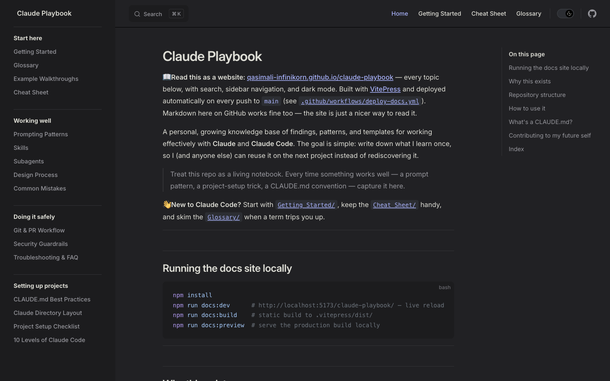

# Claude Playbook

**📖 Read this as a website: [qasimali-infinikorn.github.io/claude-playbook](https://qasimali-infinikorn.github.io/claude-playbook/)** — every topic below, with search, sidebar navigation, and dark mode. Built with [VitePress](https://vitepress.dev) and deployed automatically on every push to `main` (see [`.github/workflows/deploy-docs.yml`](./.github/workflows/deploy-docs.yml)). Markdown here on GitHub works fine too — the site is just a nicer way to read it.

A personal, growing knowledge base of findings, patterns, and templates for working effectively with **Claude** and **Claude Code**. The goal is simple: write down what I learn once, so I (and anyone else) can reuse it on the next project instead of rediscovering it.

> Treat this repo as a living notebook. Every time something works well — a prompt pattern, a project-setup trick, a CLAUDE.md convention — capture it here.

**👋 New to Claude Code?** Start with [`Getting Started/`](./Getting%20Started/), keep the [`Cheat Sheet/`](./Cheat%20Sheet/) handy, and skim the [`Glossary/`](./Glossary/) when a term trips you up.

[](https://qasimali-infinikorn.github.io/claude-playbook/)

---

## Running the docs site locally

```bash
npm install
npm run docs:dev      # http://localhost:5173/claude-playbook/ — live reload
npm run docs:build    # static build to .vitepress/dist/
npm run docs:preview  # serve the production build locally
```

---

## Why this exists

Working with an AI coding agent gets dramatically better when the project gives it the right context up front. A lot of that knowledge is reusable across projects but easy to forget. This repo is where I bank it:

- **Repeatable conventions** — e.g. the standard sections every `CLAUDE.md` should have.
- **Templates** — copy-paste starting points so a new project is set up correctly in minutes.
- **Findings** — things I learned the hard way, so I don't relearn them.

---

## Repository structure

```
claude-playbook/
├── README.md                       ← you are here
│
│   # Start here (newcomers)
├── Getting Started/                ← install, auth, first session, day-one commands
├── Glossary/                       ← plain-English definitions of the jargon
├── Example Walkthroughs/           ← annotated real sessions (bug fix, feature, review)
├── Cheat Sheet/                    ← one-page quick reference
│
│   # Working well
├── Prompting Patterns/             ← how to prompt for reliable results
├── Skills/                         ← the skills I use most, and when
├── Subagents/                      ← delegating to subagents: global roster + how to invoke
├── Loop Engineering/               ← designing safe, repeatable agent feedback loops
├── Harness/                        ← building agent/eval harnesses for repeatable evidence
├── MCP Playbook/                   ← connecting Claude Code to external tools safely
├── Plugins Playbook/               ← installing, reviewing, and sharing plugins
├── Shannon/                        ← autonomous white-box AI pentesting, setup, safety, and examples
├── Memory and Context/             ← managing CLAUDE.md, memory, handoffs, and context hygiene
├── Worktrees and Parallel Agents/  ← isolated branches for parallel attempts
├── Headless and CI/                ← non-interactive Claude Code, CI, and scheduled automation
├── Hooks Cookbook/                 ← practical hook recipes and safety gates
├── Agent Team Patterns/            ← planner/builder/reviewer/tester/judge topologies
├── Spec to Implementation/         ← turning issues and specs into verified PRs
├── Verification Recipes/           ← copy-paste checks for docs, code, UI, APIs, DB, security
├── Cost and Observability/         ← tokens, latency, traces, retries, and stop rules
├── Model Selection/                ← choosing model/reasoning depth by task risk
├── Prompt Library/                 ← ready-to-copy prompts for common workflows
├── Templates/                      ← reusable handoff, release, postmortem, harness, PR templates
├── Docs Maintenance/               ← docs quality bar, nav checks, and contribution checklist
├── Design Process/                 ← the 7-stage "real design process" for building UIs
├── Common Mistakes/                ← mistakes + the fix for each
│
│   # Doing it safely
├── Git and PR Workflow/            ← branch, review, commit, PR — without footguns
├── Security Guardrails/            ← the non-negotiables
├── Release and Deployment/         ← release, deploy, rollback, and post-deploy checks
├── Database Change Workflow/       ← safe migrations, rollback, and data-change guardrails
├── AI Coding Standards/            ← standards for agent-written code
├── Failure Postmortems/            ← turning agent failures into guardrails
├── Troubleshooting and FAQ/        ← "it's not working" → fixes
│
│   # Setting up projects
├── CLAUDE.md Best Practices/       ← the 10 standard sections + a fill-in template
├── Claude Directory Layout/        ← the .claude/ tree: agents, commands, hooks, settings.json
├── Project Setup Checklist/        ← make a new project agent-ready
├── Team Adoption/                  ← rolling Claude Code out across a team
└── 10 Levels of Claude Code/       ← the full progression: terminal → routines
```

As the playbook grows, new topics get their own top-level folder, each with its own `README.md`.

---

## How to use it

- **Starting a new project?** Open [`CLAUDE.md Best Practices/`](./CLAUDE.md%20Best%20Practices/), copy the template `CLAUDE.md` into your repo root, and fill in the 10 sections.
- **Learned something new?** Add it to the relevant folder (or create a new one) and link it from this README.
- **Browsing?** Each folder's `README.md` is the entry point for that topic.

---

## What's a `CLAUDE.md`?

`CLAUDE.md` is a file Claude Code reads automatically to understand a project: its purpose, stack, conventions, and the rules it must follow. A good one turns a generic agent into one that already knows your codebase's house style. The first topic in this playbook documents how to write one well.

---

## Contributing to my future self

Keep entries:

- **Concrete** — real commands, real rules, real examples, not vague advice.
- **Reusable** — guidance that applies beyond the one project it came from.
- **Honest** — note what *didn't* work too; negative findings save time.
- **Linked** — add a pointer from the nearest `README.md` so it's discoverable.

---

## Index

| Topic | What's inside |
|---|---|
| **Start here** | |
| [Getting Started](./Getting%20Started/) | Install, authenticate, your first session, the commands you need day one |
| [Glossary](./Glossary/) | Plain-English definitions (skill, agent, MCP, CLAUDE.md, plan mode, …) |
| [Example Walkthroughs](./Example%20Walkthroughs/) | Annotated real sessions: fix a bug, add a feature, review a diff, learn a codebase |
| [Cheat Sheet](./Cheat%20Sheet/) | One-page quick reference: commands + do's/don'ts + when-stuck |
| **Working well** | |
| [Prompting Patterns](./Prompting%20Patterns/) | Patterns for prompting Claude & Claude Code, plus API/SDK findings |
| [Skills](./Skills/) | The skills I use most (ui-ux-pro-max, grill-me, frontend-design, docs…) and when to use each |
| [Subagents](./Subagents/) | Delegating to subagents: the global subagent roster, when to use each role, and how to invoke them solo or in parallel |
| [Loop Engineering](./Loop%20Engineering/) | How to design safe agent loops: goals, verifiers, retry caps, subagents, hooks, examples, and anti-patterns |
| [Harness](./Harness/) | How to build agent/eval harnesses: fixtures, tools, graders, traces, metrics, CI patterns, and examples |
| [MCP Playbook](./MCP%20Playbook/) | Connect Claude Code to external tools/data safely: scopes, auth, examples, and guardrails |
| [Plugins Playbook](./Plugins%20Playbook/) | Review, install, share, and govern plugins |
| [Shannon](./Shannon/) | Autonomous white-box AI pentesting: architecture, safe setup, configuration, examples, reports, and limits |
| [Memory & Context](./Memory%20and%20Context/) | What belongs in prompts, `CLAUDE.md`, memory, handoffs, skills, and docs |
| [Worktrees & Parallel Agents](./Worktrees%20and%20Parallel%20Agents/) | Run isolated parallel attempts and compare outputs safely |
| [Headless & CI](./Headless%20and%20CI/) | Use Claude Code non-interactively in scripts, CI, and scheduled workflows |
| [Hooks Cookbook](./Hooks%20Cookbook/) | Practical hook recipes: block risky actions, log tools, run focused gates |
| [Agent Team Patterns](./Agent%20Team%20Patterns/) | Multi-agent topologies: planner, builder, reviewer, tester, judge |
| [Spec to Implementation](./Spec%20to%20Implementation/) | Turn an issue, PRD, or brief into tasks, code, tests, review, and PR |
| [Verification Recipes](./Verification%20Recipes/) | Copy-paste verification checklists for docs, code, UI, APIs, DB, and security |
| [Cost & Observability](./Cost%20and%20Observability/) | Track cost, latency, retries, traces, pass rates, and stop conditions |
| [Model Selection](./Model%20Selection/) | Pick model strength and reasoning depth by task risk and cost |
| [Prompt Library](./Prompt%20Library/) | Ready-to-copy prompts for common Claude Code workflows |
| [Templates](./Templates/) | Reusable handoff, release, postmortem, harness, PR, policy, and settings templates |
| [Docs Maintenance](./Docs%20Maintenance/) | Quality bar, topic checklist, navigation audit, and docs review checklist |
| [Design Process](./Design%20Process/) | The 7-stage "real design process" (grill → brief → IA → tokens → tasks → build → review) for building UIs intentionally |
| [Common Mistakes](./Common%20Mistakes/) | Mistakes I've made working with Claude + the fix for each |
| **Doing it safely** | |
| [Git & PR Workflow](./Git%20and%20PR%20Workflow/) | Branch, review the diff, commit, open a PR — without footguns |
| [Security Guardrails](./Security%20Guardrails/) | The non-negotiables: secrets, destructive commands, prod, never weaken security |
| [Release & Deployment](./Release%20and%20Deployment/) | Safe agent-assisted releases: changelog, staging, rollback, deploy approval, checks |
| [Database Change Workflow](./Database%20Change%20Workflow/) | Migrations, rollback, large-table safety, and production data guardrails |
| [AI Coding Standards](./AI%20Coding%20Standards/) | Standards for agent-written code: scope, tests, deps, comments, review |
| [Failure Postmortems](./Failure%20Postmortems/) | Turn agent mistakes into prompts, harnesses, hooks, and guardrails |
| [Troubleshooting & FAQ](./Troubleshooting%20and%20FAQ/) | Common "it's not working" situations and their fixes |
| **Setting up projects** | |
| [CLAUDE.md Best Practices](./CLAUDE.md%20Best%20Practices/) | The 10 standard sections + a ready-to-use template |
| [Claude Directory Layout](./Claude%20Directory%20Layout/) | The `.claude/` tree explained: agents, commands, hooks, skills, settings.json — with verified field names |
| [Project Setup Checklist](./Project%20Setup%20Checklist/) | Steps to make a new project agent-ready from the first prompt |
| [Team Adoption](./Team%20Adoption/) | Team rollout plan, shared policy, review norms, and governance |
| [10 Levels of Claude Code](./10%20Levels%20of%20Claude%20Code/) | The full progression from terminal use to scheduled routines, with use cases and "what to add next" at each level |

_More topics added over time._
